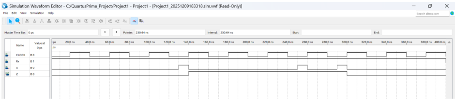

# FSM Sequence Detector
Designed a Finite State Machine sequence detector to detect specific binary sequences in a serial input stream. 
The circuit was implemented with the use of Intel Quartus Prime and uses Gray code and Reverse Gray Code.

# Project Overview
This project implements a FSM that is able to detect two predetermined binary sequences from a serial input stream.

## Detected Sequences
- 0001 -> sets output Z = 1
- 0011 -> set output Z = 0

Two different state encoding techniques were implemented and compared
- Gray Code State
- Reverse Gray Code State

The final circuit was selected based on the design that required the fewest number of gates, in this case it was the Gray Code State.

# Features
- FSM using D Flip-Flops
- State diagram and State Table
- Karnaugh Map simplification
- Logic gate implementation
- Quartus circuit simulation

# Project Structure
fsm-sequence-detector/
 ├── diagrams/
 │   ├── cost_comparison.png
 │   ├── kmap_D0.png
 │   ├── kmap_D1.png
 │   ├── kmap_D2.png
 │   ├── kmap_Z.png
 │   ├── state_diagram_gray_code.png
 │   └── state_diagram_reverse_gray_code.png
 │
 ├── quartus_project/
 │   ├── Project1.bdf
 │   ├── Project1.qpf
 │   └── Project.qsf
 │
 ├── report/
 │   └── DLS-ProjectWrittenReport.pdf
 │
 └── simulations/
     └── waveform_gray_code.png

# Circuit Design

The final circuit consists of:
- D Flip-Flops
- AND Gates
- OR Gates
- NOT Gates

The logic gates are used to compute the next state functions and determin the output

# Simulation Results
Waveform simulations were performed in Quartus to verify that the FSM was able to correctly detect both sequences and update the output accord: 

# 👨‍💻 Programmer 
Darsh Patel
Software Engineering Student - Western University
